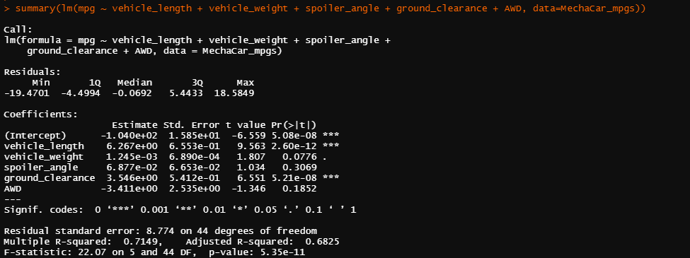

# MechaCar_Statistical_Analysis

## Project Overview
The purpose of this analysis is to assist a car dealership's data analytics team in streamlining their decision-making based on sound statics and statistical reasoning when deciding which MechaCar brand cars to populate their dealership lots with. The data analytics team is in charge of retrospective analysis of historical data and analytical verification and validation of current automotive specifications, as well as study design of future product testing. 

The dealership's executive team recognizes that the most successful automobile launches utilize data analytics in every decision-making process.

My analysis provides summary statistics for various variables and my interpretation of statistical test results. Finally, I have proposed my own study design, hypothesis and analysis workflow in order to make the manufacturing process even better.

## Resources
- Data Sources: MechaCar_mpg.csv, Suspension_Coil.csv
- Software: RStudio 2021.09.1, Visual Studio Code 1.60.2

## Linear Regression to Predict MPG
Using linear regression, I am able to compare how various variables affect the miles per gallon of a number of MechaCar car protoypes. With a slew of data concerned with six different facets of a car, and information on dozens of different cars, I used linear regression to weigh which of this facets had the greatest impact on miles per gallon.

- The vehicle length and the ground clearance provide a non-random amount of variance to the mpg values in the data set. Put differently, these two factors have a significant, reliably measurable impact on miles per gallon on a car.

- The slope of the linear model is considered to be non-zero based on the data. Given that we have two variables that carry significant impact on a car's mileage, we expect that they provide a non-random force onto the data. So, the linear model based on our data should not be wholly random - It should take some shape as we see that vehicle length and ground clearance have nonzero coefficients of variance.

- This linear model predicts the miles per gallon of MechaCar protoypes decently. The R-squared value of our analysis is 0.7149. Anything over 0.7 is considered useful in predicting future outcomes based on the present data. This essentially means that our model will correctly predict the mpg measures of MechaCars at a 71.5% success rate in the future.

## Summary Statistics on Suspension Coils
Using summary statics, we are able to get a better idea of how our data ebbs and flows.

Tasked with the question, "Does the current manufacturing data meet this design specification for all manufacturing lots in total and each lot individually?" and based on the fact that "The design specifications for the MechaCar suspension coils dictate that the variance of the suspension coils must not exceed 100 pounds per square inch," our analysis provides an answer.

Looking at the total fleet of MechaCar protoypes, the variance in suspension coils appears to be 62.3 pounds per square inch. So, in total, yes, our data meets this design specification.

But, we can use R to peek further, and divide the data into the three lots in which the cars sit. Lot 1 has a very small variance of under 1 pound per square inch; Lot 2's cars' suspension coils have a variance of 7.5 pounds per square inch. These definitely meet the design specification. However, Lot 3 has a massive variance of 170 pounds per square inch. This flies in the face of the design specifications held for these cars. 

## T-Tests on Suspension Coils
We use t-tests to test our hypotheses. Our findings will indicate which of two mutually hypotheses are supported by the data.

Our null hypothesis is that there is no significant difference between the PSI of cars in our sample to the population of all cars with mean 1500 PSI.

Our alternative hypothesis is that there is a significant difference between the PSI of cars in our sample to the population of all cars with mean 1500 PSI.

Our significance level is 0.05.

Here is a t-test on all of the cars in all manufacturing lots.

The p-value is 0.06028, just north of our significance level of 0.05. As such, we fail to reject our null hypothesis when looking at all the cars together.

The p-value for all three lots are as follows: 1 for Lot 1, 0.6027 for Lot 2, and 0.04168 for Lot 3.

Hence, we fail to reject our null hypothesis in regards of the first two lots, but with the third lot, we accept our alternative hypothesis: there is a significant differnce between the PSI of cars in our sample relative to the entire population of all MechaCar cars.

## Study Design: MechaCar vs Competition

Using our statistical capabilities, we could ideally provide a study to show to car buyers why MechaCars are best among the competition. Specifically, I think we should show three things: How MechaCar prices on our lot would compare to other car brands, maintenance cost for MechaCars, and safety ratings of MechaCar cars compared to other car brands.

We could create a one sample t-test to see how MechaCar cars compare to other car brands in their safety ratings.

-Our null hypothesis would be that there is no significant difference in safety ratings between MechaCar cars and all cars on the dealer's lot.

-Our alternative hypothesis would be that there is a significant difference in safety ratings between MechaCar cars and all cars on the dealer's lot.

We would use a t-test in order to bring our attention to any disparity in MechaCar protoype safety ratings relative to the entire dealership's car population's safety ratings. If a p-level below 0.025 were observed, we'd be aware that MechaCar cars either have extremely poor safety ratings or extremely high ones, depending which end of the tail our data lies in.

If we wanted to compare maintenance costs and purchase prices for MechaCar cars to all other cars in the lot, we could use simple summary statistics and compare mean, median, and standard deviation to see how these cars compare on the cost-side to the population of all other cars.